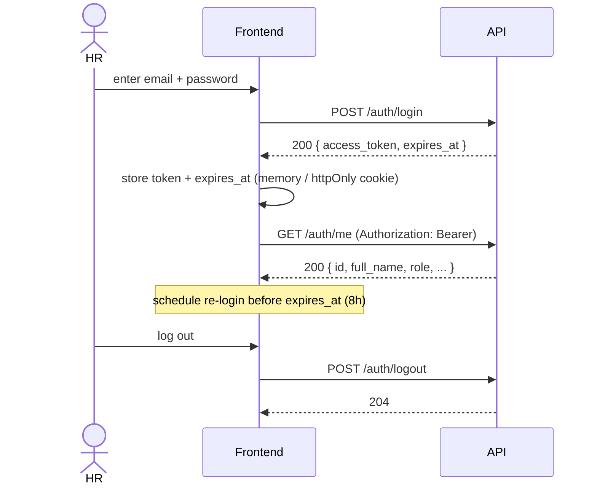
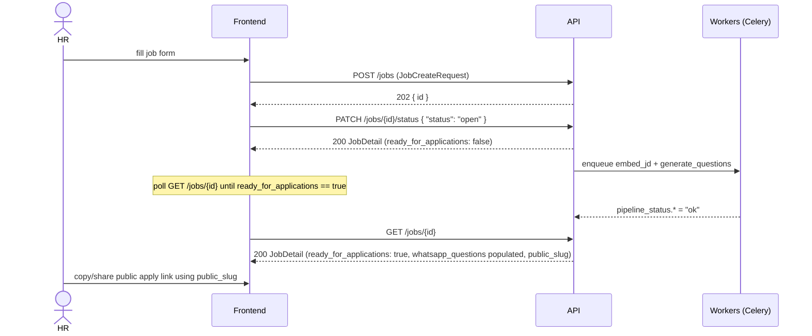
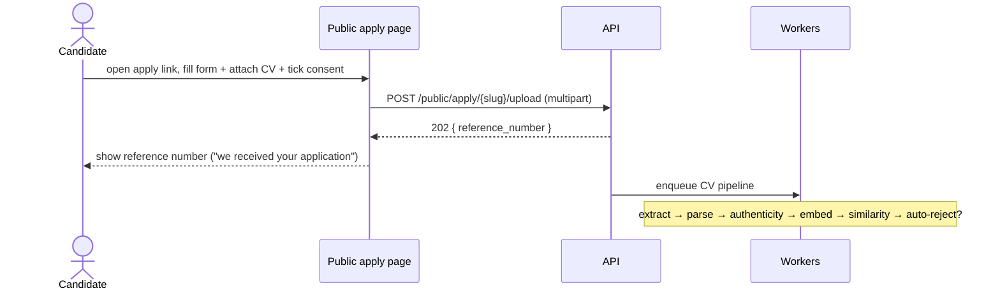
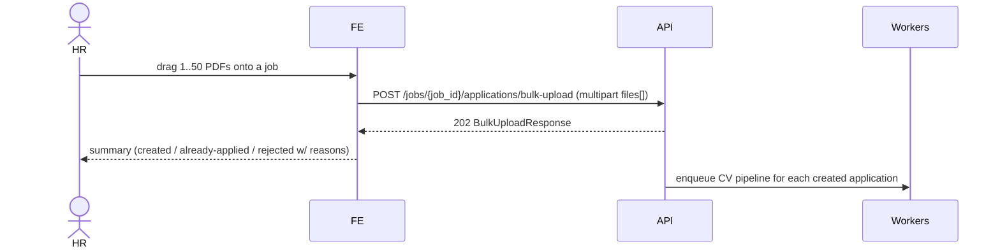
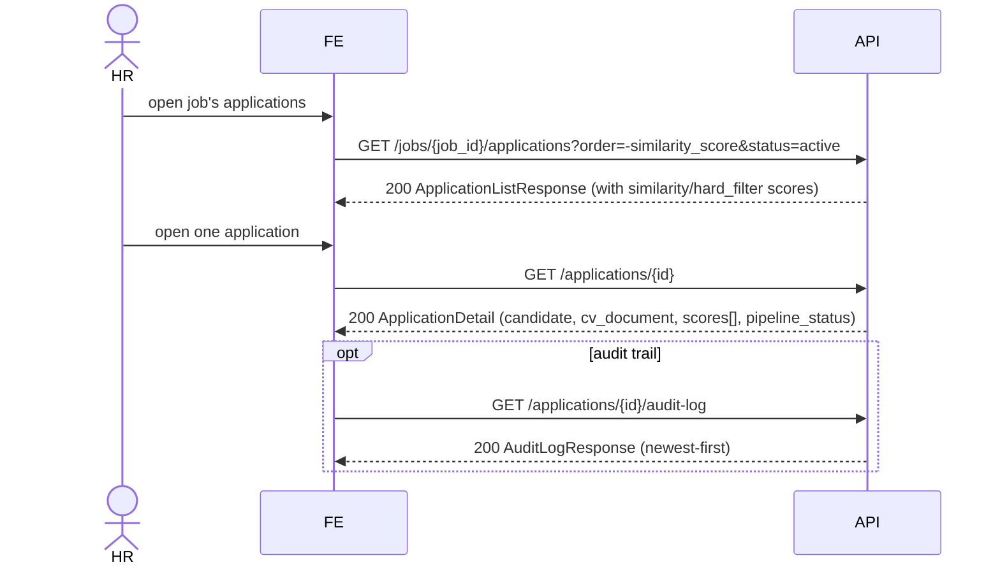
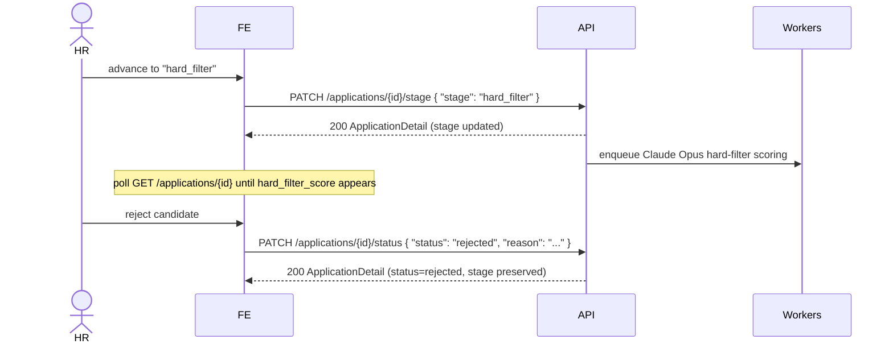
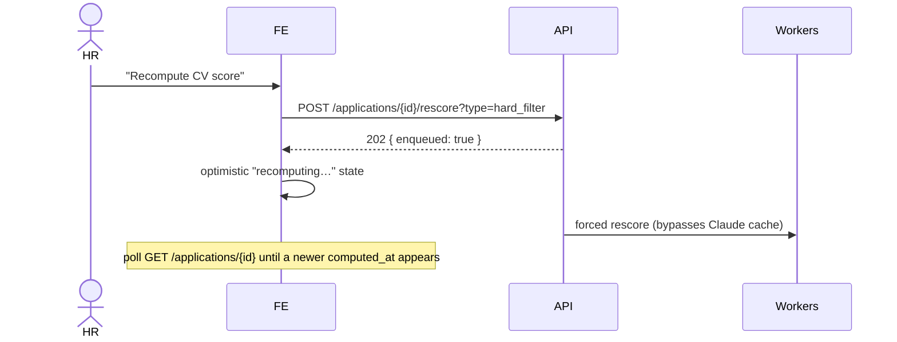
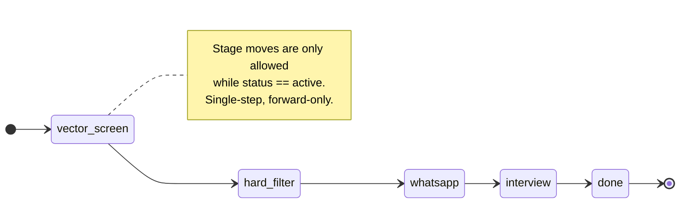
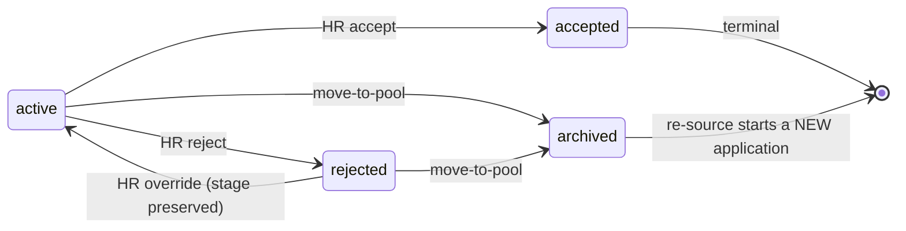

# Frontend Workflows

End-to-end journeys a Kabil.ai frontend implements, with sequence diagrams and
the state machine. Pair this with [`API_REFERENCE.md`](./API_REFERENCE.md) for
exact request/response shapes and [`ASYNC_AND_POLLING.md`](./ASYNC_AND_POLLING.md)
for the eventual-consistency rules that govern *when* data appears.

> Diagrams use Mermaid — they render on GitHub and in most Markdown viewers.

---

## The product in one paragraph

HR creates a **Job** (draft), then **opens** it — which kicks off an async job
pipeline (embed the JD + AI-generate WhatsApp screening questions) and exposes a
**public apply link**. Candidates upload a CV via that link (or HR bulk-uploads
PDFs). Each CV runs an async **CV pipeline** (extract → parse → authenticity →
embed → similarity → maybe auto-reject). HR then triages the **Applications**
list, opens an application to see the explainable scores (similarity / CV fit /
authenticity), and walks it through pipeline **stages**, rejecting/accepting
along the way. A candidate can also be moved out of a job into the **talent
pool** and later **sourced** onto other jobs — bouncing between pipeline and
pool — with the pool retaining their **full cross-job history, scored against
every job** they touched (see §8).

---

## 1. HR onboarding & auth



**FE notes**
- Keep the token out of `localStorage` if you can; an httpOnly cookie set by a
  Next.js route handler / middleware is safer. Either way, attach
  `Authorization: Bearer <token>` to every HR request.
- On any `401`, clear the session and route to login.
- Use `expires_at` to refresh proactively (there's no refresh-token endpoint —
  re-login).

---

## 2. Create & open a job (job pipeline)



**FE notes**
- **Optional AI JD Builder.** While filling the form (before `POST /jobs`), HR
  can draft the description from the Role-Basics fields via
  `POST /jobs/generate-description` (synchronous — no job is created). The
  returned text fills the editable `job_description` field; `?regenerate=true`
  re-rolls a fresh draft. This is a pure pre-step and does not affect the
  create/open flow below.
- After opening, **`ready_for_applications` is `false` until both pipeline steps
  finish.** Poll `GET /jobs/{id}` (or refetch on the detail page) and gate the
  "share link" / "questions ready" UI on that flag. See
  [`ASYNC_AND_POLLING.md`](./ASYNC_AND_POLLING.md).
- The public apply URL is built from `public_slug`, e.g.
  `https://your-frontend/apply/{public_slug}` → which posts to
  `POST /public/apply/{public_slug}/upload`.
- HR can review/edit AI questions via the WhatsApp-questions endpoints before or
  after sharing.

---

## 3. Candidate applies (public, anonymous)



**FE notes**
- `multipart/form-data` with `pdf, email, phone, full_name, consent` and a
  hidden `honeypot` input (keep it visually hidden, not `display:none`-only if
  you want to catch more bots; leave it empty for real users).
- **Identical success response** whether new, duplicate, or honeypot — never
  tell the user "you already applied". Just show the reference number.
- Handle: `410` (link expired/invalid → "this posting is no longer open"),
  `400` (missing consent / invalid email / invalid phone → field errors).
- The candidate has no further API access; the reference number is just for
  their records.

---

## 4. HR bulk-uploads CVs



**FE notes**
- Show the three buckets from the response: `applications` (new),
  `already_applied` (link straight to the existing application), `rejected`
  (with a friendly mapping of `reason` → copy, see [`ENUMS.md`](./ENUMS.md)).
- `accepted_count` = created + already-applied. `rejected_count` = rejected.
- Whole-request `400` only when file count is 0 or >50; `422` if the job is
  closed; `401` without auth.
- Newly created applications still need their CV pipeline to run before scores
  appear — same polling story as section 5.

---

## 5. Triage: list → detail → scores



**FE notes**
- List rows carry `similarity_score` and `hard_filter_score` denormalized —
  sort/filter in the UI without opening each row. `hard_filter_score` is `null`
  until the application has been through the `hard_filter` stage.
- Detail `scores[]` holds the explainability: one entry per score family with a
  `breakdown`. The `authenticity` entry has `id: null` (it's synthesized).
- `parsed_profile` is `{}` until the parse step runs — render a skeleton/"still
  processing" state, don't assume keys exist.
- Use `rejection_reason` (detail) to explain auto-rejections.

---

## 6. Move an application through the pipeline



**FE notes**
- Stage transitions are **forward-only and single-step** (see state machine
  below). Don't render "skip to interview" — a 2-step jump returns `422`.
- Entering `hard_filter` triggers async CV scoring; `hard_filter_score` is
  `null` until it lands. Poll the detail endpoint.
- Status is independent of stage: rejecting preserves the stage, and
  `rejected → active` brings the candidate back at the same stage.
- `reason` (≤500 chars) is optional but recommended — it lands in the audit log.

---

## 7. Manual rescore



**FE notes**
- The endpoint returns `202` immediately; the score updates later. The backend
  nulls the existing score while recomputing, so the detail endpoint shows
  "in progress" until the new value lands.
- Detect completion by a newer `computed_at` on the matching `scores[]` entry
  (or `hard_filter_score`/`similarity_score` becoming non-null again).

---

## 8. Talent pool ↔ pipeline: pool, re-source, full history

The flow the product is built around: a candidate can leave a job's pipeline
into the **talent pool**, be **sourced** onto another job later, and bounce back
and forth — and the pool shows their **entire cross-job history, scored against
every job they were part of**.

```mermaid
sequenceDiagram
    actor HR
    participant FE
    participant API
    participant W as Workers

    HR->>FE: move candidate out of this job (from app detail)
    FE->>API: POST /applications/{id}/move-to-pool
    API-->>FE: 200 TalentPoolEntry
    Note over API: application is ARCHIVED (not deleted) — its scores +<br/>WhatsApp transcript are kept as history; candidate re-pooled

    HR->>FE: later, source the pooled candidate onto another job
    FE->>API: POST /talent-pool/source { candidate_id, job_id }
    API-->>FE: 202 { application_id, already_existed: false }
    API->>W: full CV scoring pipeline against the new job
    Note over FE: fresh L1 application; poll GET /applications/{id} for scores

    HR->>FE: open the candidate in the pool → "history"
    FE->>API: GET /talent-pool/candidates/{candidate_id}/history
    API-->>FE: 200 CandidateHistoryResponse (every stint, scored per job)
```

**FE notes**
- **move-to-pool archives, it does not delete.** The application becomes
  `status=archived` (stage preserved) and drops out of the job's active list
  (`GET /jobs/{job_id}/applications` hides archived rows unless you pass
  `status=archived`). Its scores and WhatsApp screening survive as history.
- **Source is a *move*, not a copy.** It deactivates the candidate's pool entry
  and creates a **fresh** application at `vector_screen` flagged
  `sourced_from_talent_pool`; the full scoring pipeline re-runs against the new
  job, so poll the detail endpoint for the new scores.
- **Returning to a job they previously left is allowed.** Re-sourcing onto the
  same job creates a new live application that coexists with the archived
  stint(s) — there's no "already applied" conflict (uniqueness is enforced only
  over non-archived rows). `already_existed=true` only when a *live* application
  for that (candidate, job) already exists.
- **The history endpoint is the pool's full picture.** `stints` are newest-first,
  one per application the candidate ever had (live, rejected, accepted, or
  archived), each with its `similarity_score` / `hard_filter_score` (+
  `hard_filter_breakdown`), the append-only `scores[]`, and a WhatsApp
  `screening` digest (state + scored Q&A). Candidate-level **authenticity** is on
  `candidate` (shared across stints, not per-job). `in_pool` says whether they're
  currently pooled.
- For an archived stint's full chat, the `screening` digest carries the scored
  answers; the authoritative transcript stays at `GET /applications/{id}/whatsapp`.

---

## Application state machine



**Status (orthogonal to stage):**



> `archived` is reached **only** via `POST /applications/{id}/move-to-pool` —
> never through `PATCH /applications/{id}/status` (the status PATCH rejects it).
> An archived stint is terminal for that row; the candidate re-enters a job by
> being **sourced from the pool**, which creates a brand-new application.

| From stage | Allowed next stage |
|---|---|
| `vector_screen` | `hard_filter` |
| `hard_filter` | `whatsapp` |
| `whatsapp` | `interview` |
| `interview` | `done` |
| `done` | _(none)_ |

| From status | Allowed next status |
|---|---|
| `active` | `rejected`, `accepted` |
| `rejected` | `active` |
| `accepted` | _(terminal)_ |
| `archived` | _(terminal row; set only by move-to-pool, not the status PATCH)_ |

> `whatsapp` and `interview` stages are wired in the matrix but their feature
> surfaces (WhatsApp sessions, interview slots) land in Phase 5/6 — those keys
> are intentionally absent from responses today, not empty arrays.

---

## Appendix A: minimal typed client

A small wrapper that centralizes the base URL, auth header, and error
unwrapping. Expand as needed.

```ts
// lib/kabil/client.ts
import type { ApiError } from "./types";

const BASE = process.env.NEXT_PUBLIC_KABIL_API!;

export class KabilApiError extends Error {
  constructor(public status: number, public body: ApiError) {
    super(body.message ?? body.error);
  }
}

export async function api<T>(
  path: string,
  opts: RequestInit & { token?: string } = {},
): Promise<T> {
  const { token, headers, ...rest } = opts;
  const res = await fetch(`${BASE}${path}`, {
    ...rest,
    headers: {
      ...(token ? { Authorization: `Bearer ${token}` } : {}),
      // NOTE: do NOT set Content-Type when body is FormData
      ...headers,
    },
  });
  if (res.status === 204) return undefined as T;
  const body = await res.json();
  if (!res.ok) throw new KabilApiError(res.status, body as ApiError);
  return body as T;
}

// usage:
// const jobs = await api<JobListResponse>("/jobs?status=open", { token });
```
